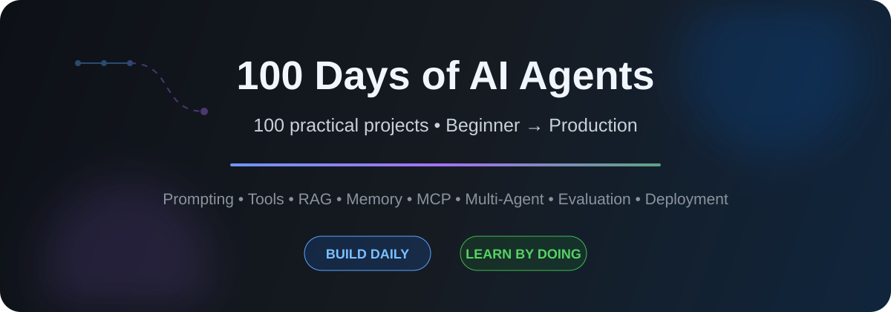

<p align="center">
  
</p>

<p align="center">
  <a href="https://github.com/sasi921/100-Days-of-AI-Agents/stargazers"></a>
  <a href="https://github.com/sasi921/100-Days-of-AI-Agents/network/members"></a>
  
</p>

<h3 align="center">Learn AI engineering by building — one useful project every day.</h3>
<p align="center"><b>Prompting → APIs → Tools → RAG → Memory → Planning → MCP → Multi-Agent Systems → Evaluation → Production</b></p>
<p align="center">⭐ <b>If this learning path is useful, star the repository so you can follow all 100 builds.</b></p>

## 🔥 Latest build

### Day 013 — Approval-Gated Action Agent

Separate reasoning from authorization: propose a state-changing action, validate it, require explicit human approval, then execute or deny with an auditable result.

**Request → Action proposal → Validation → Approval gate → Execute or deny → Record**

➡️ **[Explore Day 013](Day-013-Approval-Gated-Action-Agent/)**

## ⚡ Start here

```bash
git clone https://github.com/sasi921/100-Days-of-AI-Agents.git
cd 100-Days-of-AI-Agents/Day-001-AI-Resume-Analyzer
python -m venv .venv
```

## 📚 Project index

| Day | Project | Difficulty | What you learn |
|---:|---|---|---|
| 001 | **[AI Resume Analyzer](Day-001-AI-Resume-Analyzer/)** | 🟢 Beginner | LLM API, prompt design, JSON parsing, CLI apps |
| 002 | **[AI Weather Briefing Agent](Day-002-AI-Weather-Briefing-Agent/)** | 🟢 Beginner+ | External APIs, tool data, normalization, graceful fallback |
| 003 | **[AI Web Research Agent](Day-003-AI-Web-Research-Agent/)** | 🟢 Beginner+ | Web tools, HTML extraction, grounding, source-aware Q&A |
| 004 | **[AI Meeting Action Item Extractor](Day-004-AI-Meeting-Action-Item-Extractor/)** | 🟢 Beginner+ | Structured outputs, Pydantic schemas, validation |
| 005 | **[AI Email Reply Assistant](Day-005-AI-Email-Reply-Assistant/)** | 🟢 Beginner+ | System prompts, instruction hierarchy, prompt boundaries |
| 006 | **[AI Support Ticket Triage Bot](Day-006-AI-Support-Ticket-Triage-Bot/)** | 🟢 Beginner+ | Classification, routing, JSON Schema, escalation |
| 007 | **[AI Prompt Guardrail & Safety Gateway](Day-007-AI-Prompt-Guardrail-Safety-Gateway/)** | 🟡 Intermediate Foundations | Guardrails, prompt injection, PII review, moderation |
| 008 | **[AI Intent Router](Day-008-AI-Intent-Router/)** | 🟡 Intermediate Foundations | Intent classification, confidence thresholds, dispatch, structured routing |
| 009 | **[AI Calculator Tool Agent](Day-009-AI-Calculator-Tool-Agent/)** | 🟡 Intermediate Foundations | Tool contracts, safe execution, observations, grounded answers |
| 010 | **[AI Multi-Tool Function Calling Agent](Day-010-AI-Multi-Tool-Function-Calling-Agent/)** | 🟡 Intermediate Foundations | Function calling, tool registry, argument schemas, dispatch, graceful failure |
| 011 | **[Live Weather Tool Agent](Day-011-Live-Weather-Tool-Agent/)** | 🟡 Intermediate | External API tools, geocoding, normalization, timeouts, grounded responses |
| 012 | **[API Workflow Agent](Day-012-API-Workflow-Agent/)** | 🟡 Intermediate | Multi-step workflows, API adapters, validation, aggregation, state, error propagation |
| 013 | **[Approval-Gated Action Agent](Day-013-Approval-Gated-Action-Agent/)** | 🟡 Intermediate | Human-in-the-loop, approval gates, least privilege, state-changing tools, auditability |

**Progress: 13 / 100** — Tool-Using Agents phase in progress.

`█████████████░░░░░░░` **13%**

## 🧠 Learning roadmap

**Days 1–10 — Foundations:** Prompt engineering, structured outputs, APIs, validation, safety boundaries, intent routing, tool contracts, function calling, and dependable AI application patterns. ✅

**Days 11–25 — Tool-using agents:** Function/tool calling, search, external APIs, databases, workflows, approvals, and agents that take useful actions.

**Days 26–45 — RAG:** Embeddings, chunking, retrieval, vector databases, document assistants, citations, retrieval evaluation.

**Days 46–65 — Agent systems:** Memory, state, planning, approvals, orchestration, durable workflows, long-running tasks.

**Days 66–80 — Multi-agent systems:** Specialized agents, delegation, coordination, reviewer/critic patterns, shared state.

**Days 81–90 — MCP & integrations:** MCP servers/clients plus GitHub, email, calendars, databases, and enterprise tools.

**Days 91–100 — Production AI:** Evaluation, observability, guardrails, Docker, deployment, reliability, cost control, security, scaling.

## 🧩 Every day includes

Complete source code, dependencies, `.env.example` when needed, examples, tests or smoke checks, a polished README, concepts to study, and an extension challenge.

## 🛠️ Build with us

Read **[CONTRIBUTING.md](CONTRIBUTING.md)**, open an issue, fork the repo, or submit a focused pull request.

## 🌟 Help this project grow

⭐ **Star** the repository · 🍴 **Fork** and experiment · 💡 **Suggest a build** · 🔁 **Share a project** · 🤝 **Contribute**

<p align="center"><b>100 projects. One progressive path. Learn AI agents by building them.</b></p>
